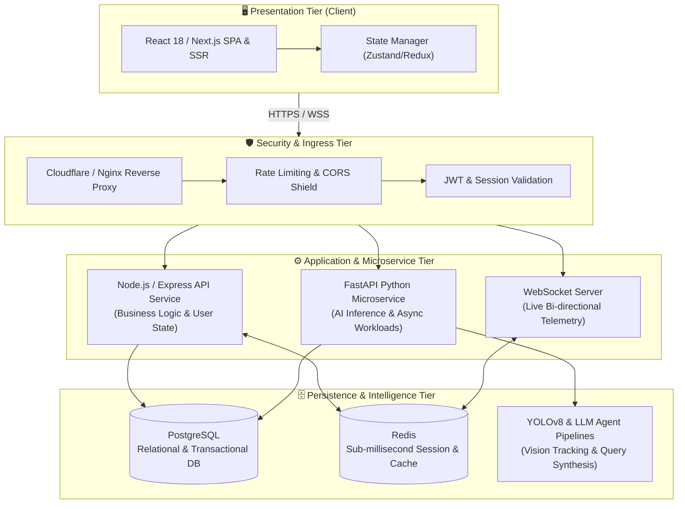

<div align="center">

<!-- HEADER BANNER -->


<!-- DYNAMIC TYPING SVG -->
<a href="https://github.com/vabhijit516-bot">
  
</a>

<br/><br/>

<!-- INTERACTIVE STATUS & COUNTER BADGES -->
<p align="center">
  <a href="https://github.com/vabhijit516-bot">
    
  </a>
  
  
  
</p>

<!-- QUICK SOCIAL CONNECT BUTTONS -->
<p align="center">
  <a href="https://linkedin.com/in/"></a>
  <a href="mailto:your-email@gmail.com"></a>
  <a href="https://github.com/vabhijit516-bot?tab=repositories"></a>
  <a href="https://github.com/vabhijit516-bot"></a>
</p>

</div>

---

## 💻 Developer Terminal & Diagnostics

```bash
┌──(abhijit㉿workstation)-[~]
└─$ cat /etc/motd
╔══════════════════════════════════════════════════════════════════════════════════════╗
║  Abhijit • Full Stack Software Engineer & Cloud Systems Architect                    ║
║  "Transforming complex business logic into high-throughput, elegant web platforms" ║
╚══════════════════════════════════════════════════════════════════════════════════════╝

┌──(abhijit㉿workstation)-[~]
└─$ curl -s https://api.abhijit.dev/v1/profile | jq .
{
  "engineer": "Abhijit (@vabhijit516-bot)",
  "specialization": "Full-Stack Development, Distributed Microservices & Applied AI",
  "frontend_stack": ["React 18", "Next.js 14", "TypeScript", "Tailwind CSS", "Vite"],
  "backend_stack": ["Node.js", "Express", "Python 3.11", "FastAPI", "WebSockets"],
  "databases": ["PostgreSQL", "MongoDB", "Redis", "SQLite", "Prisma"],
  "cloud_devops": ["Docker", "Docker Compose", "GitHub Actions CI/CD", "Linux", "Nginx"],
  "ai_intelligence": ["YOLOv8 Computer Vision", "LangChain LLM Agents", "Vector DBs"],
  "architecture_principles": ["Clean Architecture", "DRY & SOLID", "Sub-100ms Latency", "Type Safety"],
  "open_to": ["Full-Stack Software Engineer Roles", "Backend / Frontend Engineering", "High-Impact Startups"]
}

┌──(abhijit㉿workstation)-[~]
└─$ uptime --pretty
up 100% committed to engineering excellence, continuous learning, and open-source innovation.
```

---

<!-- INTERACTIVE DROPDOWN 1: TECHNICAL ARSENAL -->
<details open>
<summary><h3>🛠️ Full-Stack Technical Arsenal & Capabilities (Click to expand / collapse)</h3></summary>

<br/>

<div align="center">

#### 🎨 Frontend Engineering & Reactive UI


#### ⚙️ Backend Engineering, Microservices & APIs


#### 🗄️ Databases, Distributed Caching & Storage


#### ☁️ DevOps, Cloud Infrastructure & Tooling


#### 🤖 AI, Machine Learning & Computer Vision


</div>

</details>

---

<!-- INTERACTIVE DROPDOWN 2: SYSTEM ARCHITECTURE BLUEPRINT -->
<details open>
<summary><h3>🏗️ Production Full-Stack Architecture Blueprint (Click to expand / collapse)</h3></summary>

<br/>



</details>

---

<!-- INTERACTIVE DROPDOWN 3: FEATURED REPOSITORIES -->
<details open>
<summary><h3>🚀 Spotlight: Featured Engineering Projects (Click to expand / collapse)</h3></summary>

<br/>

| Repository & Project | Core Stack | Architectural Highlights | Direct Access |
| :--- | :--- | :--- | :---: |
| **🧠 OmniMatchAI** | `TypeScript`, `Node.js`, `React`, `AI Engine` | High-efficiency AI matching and contextual recommendation platform with intelligent semantic ranking algorithms. | [**Inspect Code**](https://github.com/vabhijit516-bot/OmniMatchAI) |
| **👁️ Vision World Model AI Suite** | `Python`, `FastAPI`, `YOLOv8`, `OpenCV`, `WebSockets` | Real-time computer vision platform featuring 30+ FPS live video HUD annotation, spatial scene reasoning, and environmental persistence. | [**Inspect Code**](https://github.com/vabhijit516-bot/hackertronix) |
| **⚡ SQL-LLM Autonomous Agent** | `JavaScript`, `LangChain`, `OpenAI`, `PostgreSQL` | Natural language to optimized SQL synthesis engine with automated syntax validation, self-correcting query execution, and schema reflection. | [**Inspect Code**](https://github.com/vabhijit516-bot/sqlllm) |
| **💼 Live Interactive Portfolio** | `TypeScript`, `React`, `Tailwind CSS`, `Vite` | Ultra-modern, responsive portfolio application engineered with glassmorphic design tokens, micro-interactions, and 100/100 Lighthouse performance. | [**Inspect Code**](https://github.com/vabhijit516-bot/liveinportfolio) |
| **🎮 UNO Reactive Multiplayer Engine** | `TypeScript`, `WebSockets`, `State Machines` | Distributed card game engine featuring event-driven turn synchronization, latency compensation, and reactive client state updates. | [**Inspect Code**](https://github.com/vabhijit516-bot/UNO-) |

</details>

---

<!-- INTERACTIVE DROPDOWN 4: LIVE TELEMETRY & GITHUB ANALYTICS -->
<details open>
<summary><h3>📊 Live GitHub Telemetry & Performance Metrics (Click to expand / collapse)</h3></summary>

<br/>

<div align="center">

<!-- GITHUB STATS & STREAK -->


<br/><br/>

<!-- TOP LANGUAGES & PROFILE DETAILS -->


<br/><br/>

<!-- REPOS & CONTRIBUTION STATS -->


</div>

</details>

---

<!-- INTERACTIVE DROPDOWN 5: ENGINEERING PHILOSOPHY -->
<details>
<summary><h3>🎯 Engineering Philosophy & 2026 Core Focus (Click to expand)</h3></summary>

<br/>

- **Architecture Over Haste**: Building modular, domain-driven systems that can easily scale from 10 to 100,000+ daily active users without architectural rewrites.
- **Latency & Performance Obsession**: Ensuring frontend bundles are hyper-optimized (tree-shaking, code-splitting) and backend queries run in sub-50 milliseconds.
- **Applied AI with Purpose**: Embedding AI models (Vision, LLMs, Vector Embeddings) into practical software products where they deliver measurable ROI and user delight.
- **Continuous Integration / Continuous Delivery**: Automated testing, linting, and containerized Docker builds on every single commit.

</details>

---

## 📬 Let's Connect & Collaborate

<p align="center">
  <b>Are you hiring for Full-Stack, Backend, or Frontend Engineering roles?</b><br/>
  I'm ready to bring technical leadership, clean code, and fast execution to your team.
</p>

<p align="center">
  <a href="mailto:your-email@gmail.com"></a>
  <a href="https://linkedin.com/in/"></a>
  <a href="https://github.com/vabhijit516-bot"></a>
</p>

<br/>

<!-- FOOTER WAVE -->
<div align="center">
  
  <p align="center">
    <sub>Crafted with passion, caffeine, and precision by <b>Abhijit</b> • © 2026</sub>
  </p>
</div>
