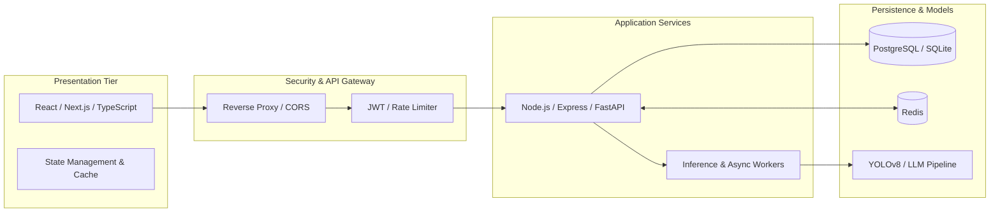

<div align="center">

# ⚡ Hi there, I'm [Abhijit](https://github.com/vabhijit516-bot) 👋
### **Full Stack Software Engineer • AI Systems & Cloud Architect**

[](https://git.io/typing-svg)

<p align="center">
  <a href="https://linkedin.com/in/"></a>
  <a href="mailto:your-email@gmail.com"></a>
  <a href="https://github.com/vabhijit516-bot"></a>
  <a href="https://github.com/vabhijit516-bot/hackertronix"></a>
</p>

---

</div>

## 👨‍💻 Executive Summary

```yaml
Developer: Abhijit (@vabhijit516-bot)
Core Domain: Full Stack Web Engineering & Scalable Backend Systems
Specializations: Microservices, Edge AI, Reactive UIs, Containerization
Key Languages: TypeScript, JavaScript, Python, SQL, HTML5/CSS3
Frameworks & Tools: React, Next.js, Node.js, Express, FastAPI, Docker, PostgreSQL
Working On: High-performance cloud applications & Computer Vision AI pipelines
Open To: Full Stack Developer roles, Software Engineer positions & Open Source
```

---

## 🛠️ Full-Stack Technical Arsenal

<div align="center">

### 🎨 Frontend Engineering


### ⚙️ Backend & API Development


### 🗄️ Database, Caching & Cloud


### 🤖 AI, Machine Learning & Vision


</div>

---

## 🚀 Featured Full-Stack & Engineering Projects

| Project | Tech Stack | Architectural Highlights | Repository |
| :--- | :--- | :--- | :---: |
| **👁️ Vision World Model AI Suite** | `Python`, `FastAPI`, `YOLOv8`, `OpenCV`, `WebSockets`, `SQLite` | Real-time computer vision system featuring live webcam streaming with HUD overlay, spatial scene reasoning, and environmental persistence. | [View Code](https://github.com/vabhijit516-bot/hackertronix) |
| **🧠 SQL-LLM Autonomous Agent** | `Python`, `LangChain`, `OpenAI`, `PostgreSQL`, `FastAPI` | Natural language to optimized SQL engine with self-correcting query execution, schema reflection, and multi-table data aggregation. | [View Code](https://github.com/vabhijit516-bot/hackertronix) |
| **⚡ NexDev Cloud & AI Operations Platform** | `React 18`, `Node.js`, `Express`, `Docker`, `TypeScript` | Full-stack developer observability platform featuring live KPI telemetry, AI prompt simulation, and Docker Compose orchestration. | [View Code](https://github.com/vabhijit516-bot/hackertronix/tree/fullstack-platform) |
| **💼 Developer Portfolio & Interactive Showcase** | `React`, `TypeScript`, `Tailwind CSS`, `Vite` | Ultra-responsive developer web application with glassmorphic cards, smooth micro-interactions, and 100/100 Lighthouse performance. | [View Code](https://github.com/vabhijit516-bot/hackertronix) |

---

## 🏗️ Full-Stack Engineering Philosophy



---

## 📊 Live GitHub Performance & Activity

<div align="center">


<br/><br/>


</div>

---

## 📬 Let's Connect & Collaborate

<p align="center">
  <b>Looking for a Full-Stack Engineer who builds scalable backends and polished frontends?</b><br/>
  Let's connect and build something impactful!
</p>

<p align="center">
  <a href="mailto:your-email@gmail.com"></a>
  <a href="https://linkedin.com/in/"></a>
  <a href="https://github.com/vabhijit516-bot"></a>
</p>

<div align="center">
  <sub>Engineered with precision by Abhijit • Continuous Learning & Open Source</sub>
</div>
