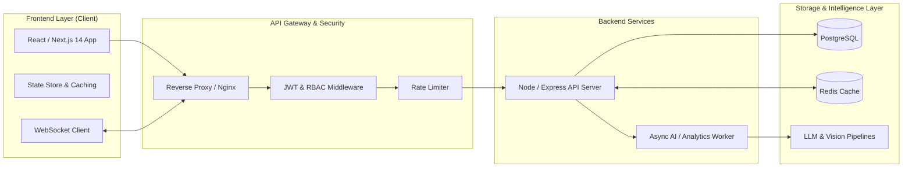

<div align="center">

# ⚡ Hi there, I'm [Abhijit](https://github.com/vabhijit516-bot) 👋
### **Full Stack Software Engineer & Systems Architect**

[](https://git.io/typing-svg)

<p align="center">
  <a href="https://linkedin.com/in/"></a>
  <a href="mailto:your-email@gmail.com"></a>
  <a href="https://github.com/vabhijit516-bot"></a>
  <a href="#"></a>
</p>

---

</div>

## 🚀 Executive Snapshot

```yaml
Name: Abhijit
Role: Full Stack Software Engineer
Core Philosophy: "Scalable architecture on the back, fluid interactions on the front"
Primary Stack: TypeScript, Next.js, Node.js, Express, PostgreSQL, Docker, Redis
Current Focus: Distributed AI Infrastructure & Enterprise Microservices
Open To: Full-Time Software Engineering Roles & High-Impact Open Source Collaboration
```

---

## 🛠️ Full-Stack Technical Arsenal

<div align="center">

### 🎨 Frontend Engineering


### ⚙️ Backend & API Architecture


### 🗄️ Database & Caching


### ☁️ DevOps, Cloud & Tooling


### 🤖 AI, LLM & Machine Learning


</div>

---

## 🌟 Featured Full-Stack Flagship Projects

| Project | Stack | Key Architecture & Highlights | Links |
| :--- | :--- | :--- | :--- |
| **🚀 AI Developer Platform & SaaS Dashboard** | `Next.js 14`, `Node.js`, `Express`, `PostgreSQL`, `Docker`, `Tailwind` | Multi-tenant developer hub with real-time analytics, AI prompt monitoring, token usage telemetry, Dockerized microservices, and end-to-end CI/CD. | [Code](https://github.com/vabhijit516-bot/hackertronix) • [Architecture](#-system-architecture) |
| **👁️ Vision World Model AI Suite** | `Python`, `FastAPI`, `YOLOv8`, `OpenCV`, `WebSockets`, `SQLite` | Real-time computer vision pipeline with live webcam HUD streaming, spatial object recognition, and memory-backed environmental tracking. | [Code](https://github.com/vabhijit516-bot/hackertronix) |
| **🧠 SQL-LLM Autonomous Data Agent** | `Python`, `LangChain`, `OpenAI`, `PostgreSQL`, `FastAPI` | Natural language to optimized SQL engine with self-correcting schema reasoning, automated query generation, and real-time visualization. | [Code](https://github.com/vabhijit516-bot/hackertronix) |
| **💼 Modern Developer Portfolio & Lab** | `React`, `TypeScript`, `Tailwind CSS`, `Framer Motion` | High-performance interactive portfolio featuring 60fps animations, 100/100 Lighthouse score, dark/light theme, and dynamic project showcases. | [Live Demo](#) • [Code](https://github.com/vabhijit516-bot/hackertronix) |

---

## 🏗️ System Architecture Philosophy

Modern full-stack engineering demands resilient decoupling, fast feedback loops, and robust observability:



---

## 📊 GitHub Analytics & Activity

<div align="center">


<br/><br/>


</div>

---

## 📈 Engineering Standards & Practices

- **Strict Type Safety**: End-to-end TypeScript interfaces between API contracts and frontend stores.
- **Containerization**: 100% reproducible environments via Docker & Docker Compose.
- **Automated Quality Gates**: GitHub Actions running ESLint, Jest unit tests, and build verification on every pull request.
- **REST & Real-time**: RESTful resource design with WebSocket channels for live event streaming.
- **Security-First**: Input validation via Zod, parameter sanitization, JWT token rotation, and CORS configuration.

---

## 💬 Get In Touch

<p align="center">
  <b>Looking for a Full-Stack Engineer who bridges frontend polish with backend reliability?</b><br/>
  Let's build something exceptional together!
</p>

<p align="center">
  <a href="mailto:your-email@gmail.com"></a>
  <a href="https://linkedin.com/in/"></a>
</p>

<div align="center">
  <sub>Designed with ❤️ for high-performance software engineering by Abhijit</sub>
</div>
