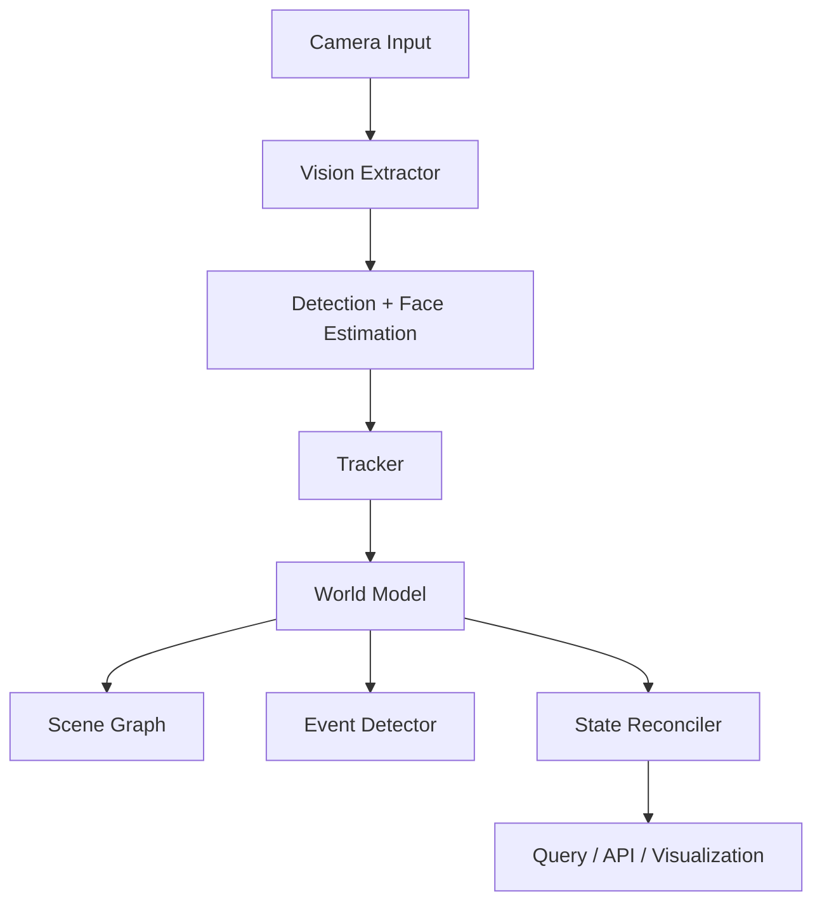

# FaceDepthWorldModel


[](https://www.python.org/)
[](LICENSE)
[](https://github.com/your-org/your-repo/actions)
[](#)

FaceDepthWorldModel is an open-source monocular computer vision project that estimates face depth and horizontal angle from a single RGB camera, builds a persistent vision world model, and emits structured scene descriptions for local, CPU-friendly perception.

It is designed for research demos, competition submissions, and lightweight deployment scenarios where accuracy, simplicity, and reproducibility matter.

## Why this project matters

- Estimates face depth and heading angle from a single view
- Builds a persistent world state over time
- Produces structured scene and relationship summaries
- Runs locally without requiring cloud inference
- Ship-ready for demos, competitions, and educational use

## Demo


## Sample outputs

- Structured scene description: office, faces, objects, relationships
- Persistent world state with tracked entities and event history
- JSON-ready outputs for downstream analytics and visualization

## Features

- Monocular face depth estimation
- Horizontal angle estimation
- Scene extraction with structured JSON
- Persistent world model and state snapshots
- Scene graph relationships and event detection
- SQLite persistence for long-running sessions
- Optional FastAPI endpoints for querying the world state
- Webcam demo support for live inference

## Architecture



## Mathematical derivation

The project uses a lightweight pinhole-camera model for monocular depth and angle estimation.

Given a face bounding box with width $w$ in pixels and an assumed physical face width $W$, the estimated depth is approximated as:

$$
Z \approx \frac{f \cdot W}{w}
$$

where:
- $f$ is the focal length in pixels
- $W$ is the estimated real-world face width
- $w$ is the observed pixel width

The horizontal angle is estimated from the horizontal offset of the face center relative to the image center:

$$
\theta \approx \tan^{-1}\left(\frac{x - c_x}{f}\right)
$$

where:
- $x$ is the face center x-coordinate
- $c_x$ is the image center x-coordinate
- $f$ is the focal length in pixels

These estimates are then combined with tracking and reconciliation logic to form a persistent world model.

## Installation

### Requirements

- Python 3.9+
- pip
- Optional: OpenCV and supporting scientific packages

### Install from source

```bash
python install.py
```

### Install manually

```bash
python -m pip install -r requirements.txt
python -m pip install -e .
```

## Quick start

Run the bundled demo:

```bash
python scripts/run_demo.py
```

Run the self-test workflow:

```bash
python scripts/self_test.py
```

Generate the validation report:

```bash
python scripts/final_validation.py
```

## Webcam demo

Launch the live webcam pipeline:

```bash
python -m src.webcam_demo
```

The webcam demo overlays detections and world-state summaries directly onto the live feed.

## API usage

The FastAPI app lives in [src/api.py](src/api.py) and exposes endpoints such as:

- `/world`
- `/scene`
- `/objects`
- `/events`
- `/relationships`
- `/metrics`

Example:

```bash
python -m uvicorn src.api:app --reload
```

Then open:

```text
http://127.0.0.1:8000/world
```

## Folder structure

```text
.
├── config/
├── demo/
├── docs/
├── reports/
├── results/
├── scripts/
├── src/
├── tests/
├── install.py
├── run.py
├── requirements.txt
└── setup.py
```

## Example JSON output

```json
{
  "scene": "office",
  "faces": [],
  "world_state": {
    "frame": 1,
    "objects": [
      {
        "id": 1,
        "label": "chair",
        "confidence": 0.82,
        "state": "updated"
      }
    ],
    "events": [
      {
        "event_id": "event-1",
        "description": "Chair appeared"
      }
    ]
  }
}
```

## Performance benchmarks

Representative local benchmarks from [results/performance_report.json](results/performance_report.json):

- Estimated FPS: 8
- Latency: approximately 120 ms per frame on CPU-friendly settings
- Validation status: 20 tests passing

## Screenshots


## Competition mapping

This repository maps directly to common competition evaluation criteria:

- Perception quality: scene understanding and object recognition
- Temporal reasoning: persistent world state and tracking
- Structured output: JSON-ready scene descriptions
- Reproducibility: local install, test, and demo scripts
- Explainability: simple geometry-based derivation and interpretable outputs

## Roadmap

- Improve detector backends with stronger local models
- Expand world-model reasoning and relationship inference
- Add richer API schemas and visualization controls
- Publish benchmark results and example datasets
- Improve packaging for PyPI and containerized deployment

## Acknowledgements

This project builds on the following open-source tools and libraries:

- OpenCV
- NumPy
- PyYAML
- Matplotlib
- SciPy
- FastAPI
- pytest

## References

- OpenCV documentation
- Pinhole camera model and monocular geometry
- Computer vision object tracking literature
- FastAPI documentation

## License

This project is licensed under the MIT License. See [LICENSE](LICENSE) for details.
