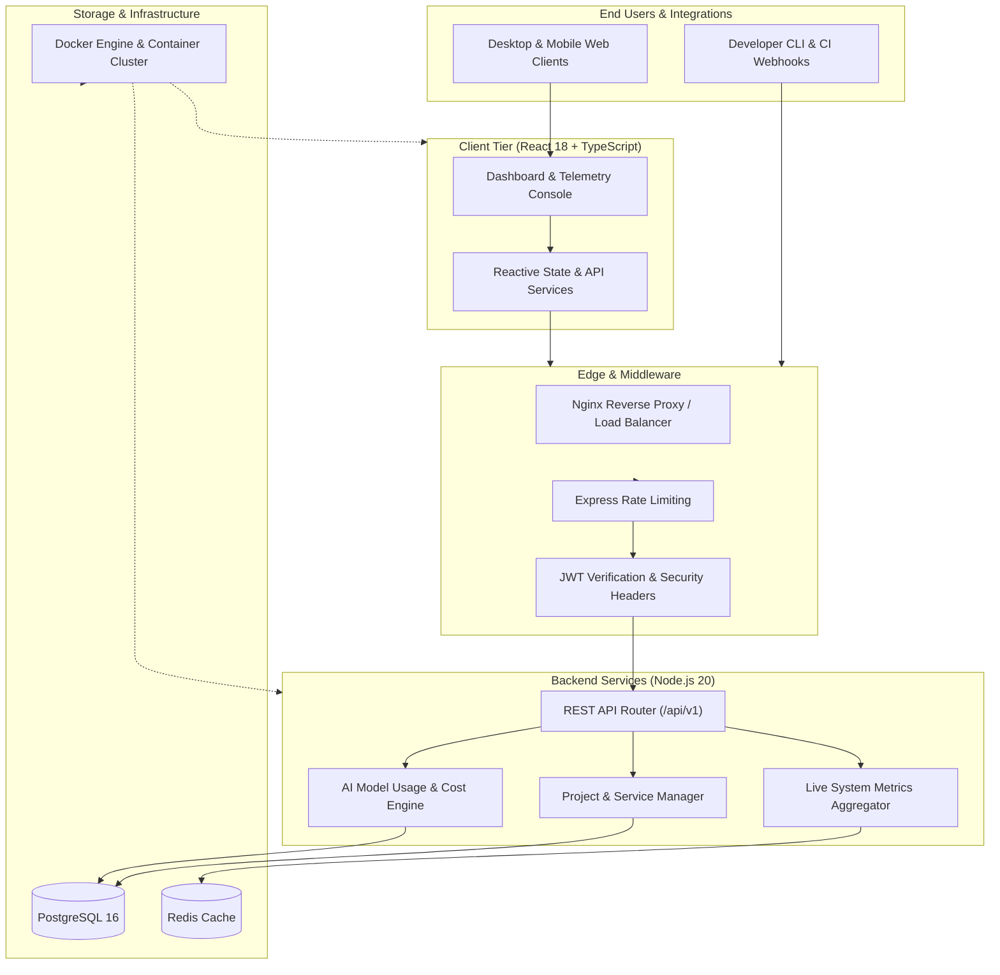

# ⚡ NexDev: Enterprise AI Developer Platform & SaaS Architecture

<div align="center">

[](https://github.com/vabhijit516-bot/hackertronix/actions)
[](https://www.typescriptlang.org/)
[](https://nodejs.org/)
[](https://react.dev/)
[](https://www.docker.com/)
[](LICENSE)

<p align="center">
  <b>A production-grade, containerized full-stack developer observability and AI operations platform.</b><br/>
  Engineered with strict TypeScript, microservice-ready backend APIs, dynamic client telemetry, and automated CI/CD quality gates.
</p>

[Quick Start](#-quick-start) • [Architecture](#-architecture) • [API Reference](#-api-specification) • [Docker Deployment](#-docker-orchestration) • [Contributing](#-contributing)

</div>

---

## 🌟 Executive Overview

**NexDev** provides development teams with a centralized telemetry dashboard to manage full-stack microservices, monitor AI model token consumption, track deployment latencies, and orchestrate API workflows. Built to showcase modern full-stack software engineering best practices:

- **End-to-End Type Safety**: Shared TypeScript domain models across client, server, and API contracts.
- **Resilient API Architecture**: Express.js REST server equipped with rate-limiting, CORS policies, centralized error boundaries, and structured JSON logs.
- **Reactive UI/UX**: Vite + React 18 dashboard styled with modern glassmorphism, responsive grid layouts, and zero external runtime UI dependencies.
- **Production DevOps**: Multi-stage Dockerfiles, Docker Compose environment with health checks, and GitHub Actions CI pipelines.

---

## 🏗️ Architecture


```mermaid
graph TD
    subgraph Users["End Users & Integrations"]
        Browser["Desktop & Mobile Web Clients"]
        CLI["Developer CLI & CI Webhooks"]
    end

    subgraph Frontend["Client Tier (React 18 + TypeScript)"]
        UI["Dashboard & Telemetry Console"]
        State["Reactive State & API Services"]
        UI --> State
    end

    subgraph Gateway["Edge & Middleware"]
        Nginx["Nginx Reverse Proxy / Load Balancer"]
        RateLimit["Express Rate Limiting"]
        Auth["JWT Verification & Security Headers"]
    end

    subgraph Backend["Backend Services (Node.js 20)"]
        API["REST API Router (/api/v1)"]
        ProjectService["Project & Service Manager"]
        AIService["AI Model Usage & Cost Engine"]
        MetricsService["Live System Metrics Aggregator"]
    end

    subgraph Persistence["Storage & Infrastructure"]
        Postgres[("PostgreSQL 16")]
        RedisCache[("Redis Cache")]
        Docker["Docker Engine & Container Cluster"]
    end

    Browser --> UI
    CLI --> Gateway
    State --> Gateway
    Gateway --> RateLimit --> Auth --> API
    API --> ProjectService --> Postgres
    API --> AIService --> Postgres
    API --> MetricsService --> RedisCache
    Docker -.-> Frontend
    Docker -.-> Backend
    Docker -.-> Persistence
```

---

## 🛠️ Technology Stack

| Layer | Technology | Key Capabilities |
| :--- | :--- | :--- |
| **Frontend** | React 18, TypeScript, Vite | Component-driven UI, CSS custom property design system, zero bloated UI libraries, responsive charts |
| **Backend** | Node.js, Express, TypeScript | RESTful JSON API, strict payload validation, modular controller architecture, asynchronous error handling |
| **Security** | Helmet, CORS, Express-Rate-Limit | Header fortification, DDOS mitigation, credential sanitization, secure environment isolation |
| **Data Layer** | PostgreSQL, Redis (Optional), In-Memory Mock Store | ACID transactions, query indexing, low-latency caching layer |
| **DevOps** | Docker, Docker Compose, GitHub Actions | Multi-stage image builds, automated test execution, linting verification, multi-container orchestration |

---

## 📂 Project Structure

```text
├── .github/
│   ├── workflows/
│   │   ├── ci.yml                 # Automated testing, linting & build verification
│   │   └── profile-updater.yml   # Scheduled GitHub stats sync
│   ├── ISSUE_TEMPLATE/
│   │   ├── bug_report.md
│   │   └── feature_request.md
│   └── PULL_REQUEST_TEMPLATE.md
├── client/                        # React 18 TypeScript Frontend
│   ├── public/
│   ├── src/
│   │   ├── components/           # Navbar, MetricsCards, ProjectManager, AITelemetry
│   │   ├── services/             # API client & HTTP abstraction
│   │   ├── types/                # Frontend data models
│   │   ├── App.tsx               # Main Application Layout
│   │   ├── main.tsx              # React Entry Point
│   │   └── index.css             # High-Aesthetic Modern CSS System
│   ├── Dockerfile
│   ├── package.json
│   ├── tsconfig.json
│   └── vite.config.ts
├── server/                        # Node.js Express TypeScript Backend
│   ├── src/
│   │   ├── controllers/          # Business logic handlers
│   │   ├── middleware/           # Auth, Error handling, Rate limiting
│   │   ├── routes/               # API route definitions
│   │   ├── services/             # Mock DB & Telemetry engines
│   │   ├── types/                # Backend data models
│   │   └── index.ts              # Express Server entry point
│   ├── Dockerfile
│   ├── package.json
│   └── tsconfig.json
├── docker-compose.yml             # Full-stack multi-container orchestrator
├── .env.example                   # Baseline environment configuration
├── .gitignore
├── CONTRIBUTING.md                # Open-source contribution guidelines
├── LICENSE                        # Open-source MIT License
├── PROFILE_README.md              # Standalone GitHub Profile README template
├── SETUP_GUIDE.md                 # Complete guide to deploying & showcasing on GitHub
└── README.md                      # This project documentation
```

---

## ⚡ Quick Start

### Option 1: One-Command Docker Launch (Recommended)

Ensure you have [Docker](https://www.docker.com/) and [Docker Compose](https://docs.docker.com/compose/) installed:

```bash
# Clone the repository
git clone https://github.com/vabhijit516-bot/hackertronix.git
cd hackertronix

# Start all full-stack services in the background
docker-compose up --build -d
```

- **Client Application**: [http://localhost:5173](http://localhost:5173)
- **Backend API**: [http://localhost:5000](http://localhost:5000)
- **API Health Check**: [http://localhost:5000/api/health](http://localhost:5000/api/health)

### Option 2: Local Development Setup

#### 1. Backend Server
```bash
cd server
npm install
npm run dev
# Server boots on http://localhost:5000
```

#### 2. Frontend Client
```bash
cd ../client
npm install
npm run dev
# Client boots on http://localhost:5173
```

---

## 📡 API Specification

All API endpoints return standard JSON responses with HTTP status codes.

| Method | Endpoint | Description | Auth Required |
| :--- | :--- | :--- | :---: |
| `GET` | `/api/health` | Service uptime and heartbeat check | ❌ |
| `GET` | `/api/projects` | List all tracked full-stack services | ❌ |
| `POST` | `/api/projects` | Register a new service/project | ❌ |
| `DELETE` | `/api/projects/:id` | Remove a project | ❌ |
| `GET` | `/api/ai/analytics` | Telemetry on LLM token usage, cost, and latency | ❌ |
| `GET` | `/api/metrics` | System performance KPI summary | ❌ |

### Example Payload: Register a Project (`POST /api/projects`)

```json
{
  "name": "Vision-World-Model",
  "category": "AI / Computer Vision",
  "status": "Healthy",
  "latency": 32,
  "uptime": "99.98%",
  "tags": ["Python", "FastAPI", "YOLOv8"]
}
```

---

## 🧪 Testing & Code Quality

Run automated test suites and linting across services:

```bash
# Run backend tests
cd server && npm test

# Run frontend lint check
cd ../client && npm run build
```

---

## 🤝 Contributing

Contributions, issues, and feature requests are welcome!  
Please review the [Contributing Guide](CONTRIBUTING.md) before submitting pull requests.

1. Fork the Project
2. Create your Feature Branch (`git checkout -b feature/AmazingFeature`)
3. Commit your Changes (`git commit -m 'feat: Add AmazingFeature'`)
4. Push to the Branch (`git push origin feature/AmazingFeature`)
5. Open a Pull Request

---

## 📜 License

Distributed under the MIT License. See [LICENSE](LICENSE) for more information.

---

<div align="center">
  <b>Built with precision by <a href="https://github.com/vabhijit516-bot">Abhijit</a></b> • Full-Stack Software Engineer
</div>
